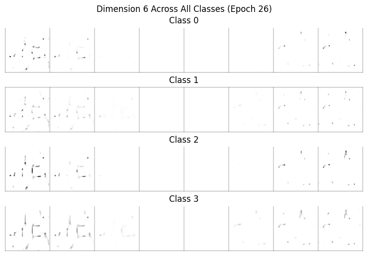
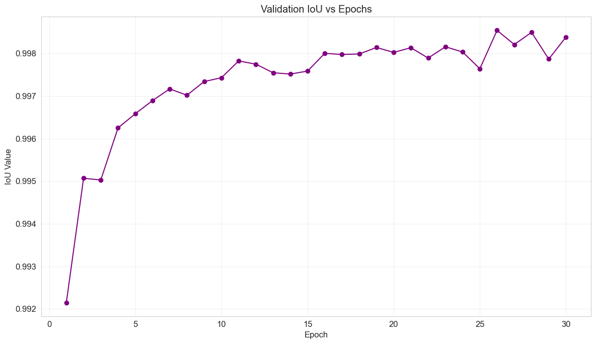
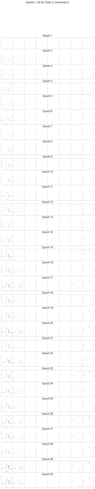

# CVAE-Shape-Generation

A Conditional Variational Autoencoder (CVAE) implementation for generating and analyzing geometric shapes with explainable AI (XAI) techniques.

## Overview

This project implements a deep learning model using a Conditional Variational Autoencoder (CVAE) designed to generate high-resolution geometric shapes with controlled attributes. While traditional VAEs generate samples from a latent space without class specificity, this CVAE integrates conditional information (labels) into both the encoder and decoder, allowing the model to be explicitly directed to produce data of a preferred category.

The project focuses on 512x512 grayscale images of quadrilaterals and includes a comprehensive Explainable AI (XAI) pipeline to interpret the model's latent space and reconstruction capabilities.

## Features

- **High-Resolution Generation**: 512×512 image generation with 6-layer convolutional architecture
- **Multi-Class Support**: 4 shape classes (filled/unfilled squares and rectangles)
- **Comprehensive Loss Tracking**: Per-batch and per-epoch tracking of BCE, KL divergence, MSE, and IoU metrics
- **XAI Techniques**:
  - t-SNE latent space visualization
  - DiCE counterfactual explanations
  - Confusion matrix analysis
  - Latent traversal visualization

## Architecture

The architecture is a **Convolutional CVAE** following the standard Encoder-Latent Space-Decoder framework.

### 1. Encoder
* **Structure:** Six convolutional layers with batch normalization and ReLU activations.
* **Function:** Systematically downsamples the input to capture hierarchical features.
* **Output:** Produces two vectors: the mean ($\mu$) and log-variance ($\log \sigma^2$) of the latent distribution.

### 2. Latent Space (Reparameterization Trick)
* **Dimensions:** 100.
* **Sampling:** To allow backpropagation, the latent vector $z$ is sampled using the reparameterization trick:
    $$z = \mu + \sigma \cdot \epsilon, \quad \epsilon \sim \mathcal{N}(0,1)$$

### 3. Decoder
* **Structure:** A fully connected layer followed by six transposed convolutional layers, batch normalization, and ReLU activations.
* **Output Activation:** A **Sigmoid** activation is used at the final layer to constrain pixel values to $.
* **Conditioning:** The latent vector $z$ is concatenated with the condition label $y$ to ensure the model generates the correct object type.

## Loss Functions & Optimization
The model was trained for **30 epochs** using the **Adam optimizer** ($lr=1\times10^{-4}$, batch size=8)[cite: 82]. [cite_start]The total training loss is a combination of reconstruction accuracy and latent regularity.

$$L_{total} = L_{BCE} + L_{KL}$$

### 1. Binary Cross-Entropy (BCE)
Measures the pixel-wise reconstruction error.
$$L_{BCE}(x, \hat{x}) = - \sum_{i=1}^{N} [x_i \log(\hat{x}_i) + (1-x_i) \log(1-\hat{x}_i)]$$

### 2. Kullback-Leibler (KL) Divergence
Regularizes the latent space to approximate a standard Gaussian prior, preventing overfitting.
$$L_{KL} = -\frac{1}{2} \sum_{j=1}^{d} (1 + \log(\sigma_j^2) - \mu_j^2 - \sigma_j^2)$$

### 3. Intersection over Union Error (IUE)
Used as a specific geometric metric for validation (not optimization). [cite_start]It captures shape-level structural discrepancies.
$$IUE = 1 - IoU$$


## Explainability (XAI) Pipeline
To interpret the "black box" nature of the model, two visualization techniques were implemented:

### Latent Traversals
* **Method:** Systematically varying one latent dimension (from -3 to +3) while keeping others fixed.
* **Insight:** Reveals that specific dimensions control interpretable attributes such as aspect ratio (Square $\leftrightarrow$ Rectangle), fill status, and edge sharpness.
### Reconstruction Error Heatmaps
* **Method:** Visualizes the pixel-wise squared error between the input $x$ and reconstruction $\hat{x}$:
    $$Error(i,j) = (x_{i,j} - \hat{x}_{i,j})^2$$
* **Insight:** Unfilled shapes typically show higher error at boundaries (brighter regions in heatmaps) compared to filled shapes, indicating the model works harder to reproduce sharp edges.

- **Encoder**: 6-layer convolutional network with batch normalization
- **Latent Space**: 100-dimensional latent representation
- **Decoder**: 6-layer transposed convolutional network
- **Loss Components**: 
  - Binary Cross-Entropy (reconstruction)
  - KL Divergence (with annealing: 0.01 → 1.0)
  - Mean Squared Error
  - Intersection over Union (IoU)

## Requirements

See [requirements.txt](requirements.txt) for a complete list of dependencies.

Main requirements:
- Python 3.8+
- PyTorch 2.0+
- torchvision
- numpy
- pandas
- matplotlib
- seaborn
- scikit-learn
- Pillow
- tqdm

## Installation

```bash
# Clone the repository
git clone git@github.com:vishal-rk/CVAE-Shape-Generation.git
cd CVAE-Shape-Generation

# Create a virtual environment (recommended)
python -m venv venv
source venv/bin/activate  # On Windows: venv\Scripts\activate

# Install dependencies
pip install -r requirements.txt
```

## Dataset Structure

The model works with a structured geometric dataset categorized into four classes:
Filled Squares 
Unfilled Squares 
Filled Rectangles
Unfilled Rectangles

The model expects the following directory structure:

```
data/
└── [parent_dir]/
    ├── sized_squares_filled/
    │   ├── train/
    │   ├── val/
    │   └── test/
    ├── sized_squares_unfilled/
    │   ├── train/
    │   ├── val/
    │   └── test/
    ├── sized_rectangles_filled/
    │   ├── train/
    │   ├── val/
    │   └── test/
    └── sized_rectangles_unfilled/
        ├── train/
        ├── val/
        └── test/
```

## Usage

### Training

```bash
python cvae_training_cuda_fixed.py
```

**Training Configuration:**
- Epochs: 30
- Batch Size: 8
- Learning Rate: 5e-5
- Latent Size: 100
- Image Size: 512×512

The training script automatically:
- Saves model checkpoints every epoch
- Tracks and saves detailed loss metrics
- Generates sample images per epoch
- Creates reconstruction comparisons

**Output Directories:**
- `cvae_demo/cvae_512_checkpoints/`: Model checkpoints
- `cvae_demo/cvae_512_results/`: Generated samples and reconstructions
- `cvae_demo/cvae_512_losses/`: Comprehensive loss logs (per-batch and per-epoch)

### Testing & Evaluation

**Confusion Matrix:**
```bash
python cvae_confusion_matrix.py
```
Generates confusion matrix for reconstructed images based on IoU metrics.

**t-SNE Visualization:**
```bash
python cvae_xai.py
# or
python cvae_xai_100.py  # For 100-dimensional latent space
```
Creates latent space visualizations and traversal plots.

**DiCE Counterfactuals:**
```bash
python dice.py
# or
python cvae_counterfactual.py
```
Generates counterfactual explanations using multiple methods:
- Simple counterfactuals (direct class swap)
- Path interpolation
- Optimization-based counterfactuals
- Feature importance analysis

## Results

- **Best Model**: Epoch 26
- **Validation IoU**: ~0.9985
- **Architecture Stability**: KL annealing prevents posterior collapse
- **Latent Space**: Dimension 6 shows consistent geometric feature control

### Sample Outputs

**Generated Samples Across Classes (Epoch 26)**


*Model-generated shapes for all 4 classes showing consistent quality and class-specific features.*

**Training Metrics**


*Loss components (BCE, KL, MSE) across 30 training epochs showing stable convergence.*

**IoU Performance**


*Intersection over Union metric progression demonstrating excellent reconstruction quality.*

**Latent Space Traversal**


*Smooth interpolation through latent dimension 6 showing learned geometric features.*

## Key Features

### Loss Tracking
The training script provides comprehensive loss tracking at multiple granularities:
- **Per-batch**: Individual batch losses saved as CSV and TXT files
- **Per-epoch**: Epoch-level summaries with all components
- **Complete history**: Full training history in JSON format

### XAI Analysis
Post-training analysis includes:
- Latent space exploration via t-SNE
- Counterfactual generation for understanding model decisions
- Confusion matrix for classification performance
- Latent dimension traversals showing learned features

## File Structure

```
├── cvae_training_cuda_fixed.py   # Main training script
├── cvae_confusion_matrix.py      # Confusion matrix generation
├── cvae_counterfactual.py        # Counterfactual analysis
├── cvae_xai.py                   # t-SNE and XAI visualizations
├── cvae_xai_100.py               # Extended XAI for 100D latent
├── dice.py                       # DiCE counterfactual implementation
├── requirements.txt              # Python dependencies
└── README.md                     # This file
```

## Training Tips

1. **Memory Management**: Batch size of 8 is recommended for 512×512 images on typical GPUs
2. **KL Annealing**: Gradually increases from 0.01 to 1.0 to prevent posterior collapse
3. **Gradient Clipping**: Max norm of 1.0 prevents exploding gradients
4. **Checkpointing**: Model saves every epoch, allowing resumption from any point

## Contributing

Contributions are welcome! Please follow these steps:

1. Fork the repository
2. Create a feature branch (`git checkout -b feature/AmazingFeature`)
3. Commit your changes (`git commit -m 'Add some AmazingFeature'`)
4. Push to the branch (`git push origin feature/AmazingFeature`)
5. Open a Pull Request

## Roadmap

- [ ] Add support for color images
- [ ] Implement β-VAE for better disentanglement
- [ ] Add more shape classes
- [ ] Improve XAI visualizations
- [ ] Create web demo interface
- [ ] Add pre-trained model downloads
- [ ] Implement style transfer capabilities

---

## Citation

If you use this code in your research, please cite:

```bibtex
@misc{cvae-shape-generation,
  author = {Vishal RK},
  title = {CVAE-Shape-Generation: Conditional VAE for Geometric Shape Generation with XAI},
  year = {2025},
  publisher = {GitHub},
  url = {https://github.com/vishal-rk/CVAE-Shape-Generation}
}
```

## License

MIT License - See LICENSE file for details

## Acknowledgments

- Built with PyTorch
- The VAE research community for foundational work
- XAI techniques inspired by DiCE and t-SNE literature

## Contact

For questions or issues, please open an issue on GitHub or contact via the repository.
